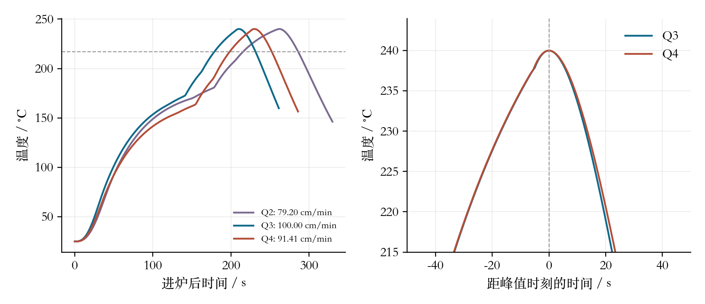

# 历史题回放与证据

以下命令均从仓库根目录执行，需自行提供原始题面与附件。历史回放不等于新盲测，数值复核也不替代人工评阅。

## 2021 C：本地限时演练与官方模板交付

依据项目接触记录选题，首次正文阅读前计时，52.5分钟内完成四问、两个原名官方工作簿、17页正文和52页完整源码附录。期间未读取同题参赛论文或题解；模型预训练接触无法排除，本地时间线也不是独立阅读隔离认证。

[论文](reports/supply-2021c-paper.pdf) · [可复跑支撑包](reports/supply-2021c-support.zip) · [结果与复算](reports/supply-2021c-summary.json) · [模拟评阅及缺口](reports/supply-2021c-review.md)

在有订货周均值定义的标准合同能力下，至少26家供应商；25家即使用最佳转运损耗也只能支持28044.406产品立方米/周，低于28200需求。稳态供货产能为33335.925；初始库存固定为原产能两周且首周即维持新两周库存时，立即可用的恒定产量为29911.975产品立方米/周。两种数值对应不同库存条件，不能混用。

完整工作簿：[附件A](reports/supply-2021c/附件A%20订购方案数据结果.xlsx)、[附件B](reports/supply-2021c/附件B%20转运方案数据结果.xlsx)。每个填报值已从保存后的文件读回比较，原表头、供应商顺序及合并区域保留。仓库外从原数据重新求解并重建工作簿/PDF，17页正文像素一致。

```bash
.venv/bin/python benchmarks/supply_2021c/run_all.py \
  --source /path/2021/C --output runs/supply-replay
```

安装`benchmarks/supply_2021c/requirements.txt`。默认复算数值，添加`--deliver`重建官方工作簿、图表、支撑包和论文；完整交付需要Codex提供的artifact-tool Node运行时、中文字体及Tectonic/XeLaTeX，可通过`--node`、`--artifact-modules`、`--latex-compiler`与`--cache-dir`指定。支撑包解压后用其中的`run_all.py`执行同样命令。

本次还修复了长文件清单跨页裁切：排版器支持带重复表头的长表，并以85行真实TeX分页测试验证。工作流跑通不等于政策可靠；后48周的供货总量诊断误差较大，实际能力上限未校准，正式AI声明和独立使用详情尚未满足2026提交检查。上述限制保留在冻结成果中，后续改进不追溯修改此次成绩。

### 后续供货模型比较：没有证据就不升级

[回溯实验](reports/supply-response/report.json)固定7种候选，在7个连续24周窗口前分别只用历史拟合；模型选择使用前两个24周窗口的产品当量总供货平方误差。所有历史数据此前已被分析者接触，因此这是回溯验证，不是新的未见数据成绩，也不是对改变订货政策的因果验证。

| 方法 | 每周总供货MAE | 每周总供货RMSE | 平均偏差 |
| --- | ---: | ---: | ---: |
| 全历史数量比例 | 6427.34 | 9647.35 | 129.16 |
| 全历史饱和响应 | 6174.19 | 10696.88 | -1646.28 |
| 仅按此前窗口选模 | 6624.35 | 10009.84 | -534.72 |

单位均为产品立方米；低MAE并不意味着大误差风险同步降低。嵌套选模没有优于基线，故不替换冻结计划。[逐预测值](reports/supply-response/predictions.npz)与[独立标量核算](reports/supply-response/verification.json)保留全部比较，包括较差的候选。

[订货支持审计](reports/supply-response/order-support.json)发现S140推荐量约2186.83原料立方米，夹在历史20与6000的订货空档中，不能仅因未超过历史最大值就视为充分支持。若暂不依赖S140，[备用计划](reports/supply-response/contingency.json)需要35家，归一化24周采购费490923.50，比原26家方案低199.79，但多9家合同且仍有S338、S374两处邻近数据不足。[独立按材料类别计数枚举](reports/supply-response/contingency-verification.json)证明34家最高只能支持28180.06，低于28200需求。这里是供应商暂不可用的情景，不是判定S140无法供货，更不是已确认的安全方案。

可复用`conditional_supply.py`接口按供应商×周矩阵拟合，返回预测及历史范围外、内部空档、冷启动诊断；需NumPy。邻近定义为订购量±20%，是可调诊断口径，不是统计有效性门槛。

```python
from conditional_supply import fit_response, predict_response
model = fit_response(past_orders, past_supply, method="ratio_all")
prediction, support = predict_response(model, future_orders)
```

复跑实验和独立核算：

```bash
.venv/bin/python benchmarks/supply_2021c/response_study.py RUN --output NEW_DIRECTORY
.venv/bin/python benchmarks/supply_2021c/verify_response_study.py RUN NEW_DIRECTORY
```

### 发运前调整

`transport_recourse.py`在实际供货量已知、尚未发运时重分配运输，保留全部收购量，并分别报告运力不足、到货不足和库存缺口。[12个既有计划扰动案例](reports/transport-recourse.json)由独立排序构造核对最大产品到货及最小原料损耗，具体输入与分配见[案例包](reports/transport-recourse-cases.zip)。第二问供货增加10%时，原计划三家各超载600立方米，改派1800立方米后可运走全部货物；T3停运时虽能运走原料，仍无法满足原两周库存目标。

```python
from transport_recourse import reallocate, inventory_step
result = reallocate(actual_supply, carrier_capacities, estimated_losses,
                    material_conversion, required_receipt=target, reference=proposal)
```

适用于可拆分、无禁配路线的连续运输；损耗是发运前估计，不是预知的实际损耗。供货不足不会因重排运输自动消失。次级最小改派量由线性规划证书支持，目标数值容差为1e-7。原稿未修改，本模块作为赛前辅助功能补充。

## 2020 A：连续模型与约束优化

2020 A“炉温曲线”的项目内首次实测，在约30分钟内完成四问和671条采样输出，29项独立数值检查通过。原8页稿的结构、字体与公式排版不合格，先前的排版通过记录已撤回。当前22页修订稿采用摘要独页、背景与条件—逐问要求的重述、逐问分析、模型假设、符号说明与分问求解结构，并使用宋体、黑体和TeX数学公式。修订补充了完整优化约束、求解设置与同预算算法对照；数值验收与论文修订分别记录。

[训练稿 PDF](reports/furnace-2020a-paper.pdf) · [验收记录与边界](reports/furnace-2020a-summary.json)

第5.2—5.3节给出固定模型下的速度上界推导和温区参数非唯一性解释，配有[可复跑的恒等式与等价方案验证](reports/furnace-2020a-structural-evidence.json)。这些结论以参数可迁移等明确假设为前提，不替代新工况实验。

第5.4、6.1—6.2节比较面积—对称性权衡、候选模型决策差异和256个联合参数情景：[计算记录](reports/furnace-2020a-decision-evidence.json)。它揭示逐参数检验通过的留余量方案仍可能在联合扰动下越界；情景计数不冒充实际失败概率。

第6.3节针对反例重新进行[情景约束设计](reports/furnace-2020a-scenario-design.json)：161组设计参数，冻结候选后再以512组留出参数验证，三组方案均未发生制程越界。结果同时报告速度/面积代价，并明确不保证整个参数盒或实际生产可靠性。

算法是否值得增加，也用实测回答：[同预算对照](reports/furnace-2020a-optimizer-comparison/report.json)在两个优化问题上比较多起点SLSQP、DE和DE后SLSQP。每次2400次模型计算、6个固定种子，36个候选均通过独立连续积分后的严格约束检查；局部法与组合结果近乎相同，未显示增加DE的必要性。协议、逐次结果及失败判定都可复查；结论仅限该模型、起点策略与预算。

该留档仍是训练稿，尚未补齐正式提交所需的完整代码附录、AI详情及实际人工审查，不能将数值验收代替论文和规则验收。



自备原始题面与附件后可一键回放，包含算法对照（首次TeX下载另计）：

可选依赖建议装在项目虚拟环境：先运行 `python3 -m venv .venv`，macOS/Linux再用 `source .venv/bin/activate`，随后执行下面的命令。

```bash
python3 -m pip install -r benchmarks/furnace_2020a/requirements.txt -r requirements-paper.txt
python3 benchmarks/furnace_2020a/run_all.py --source-dir /path/2020/A --output runs/furnace
```

数学论文需要Tectonic或XeLaTeX（macOS可用 `brew install tectonic`），未在PATH中时加 `--latex-compiler /path/to/tectonic`。首次编译需要下载宏包；`--cache-dir`可指定缓存目录。回放不等于新盲测，真实人工评阅与正式提交审核仍待完成。

已有炉温运行结果时，可单独复跑方法对照，无需重新校准：

```bash
python3 benchmarks/furnace_2020a/optimizer_comparison.py runs/furnace --output runs/optimizer-study
```

输出目录须不存在。先写入固定协议，再执行搜索；独立复核后不重新选解，保留严格可行与数值容差可行两种判定。

## 2020 D：旧限时稿的重新验收

2026-09-04的本地时间线记录约142分钟完成，旧评审给出93/100。对冻结PDF、程序和输出的[重新复核](reports/profilometer-2020d-legacy-audit.json)不接受它作为完整限时论文：摘要与正文混页、公式以普通字符排版、倾角方法描述矛盾，第三问缺完整特征清单，第四问未实际输出修正后的轮廓。原稿、旧评分和时间线保留，后续修订不补算为限时成绩；本次也不能独立证明当时的阅读隔离。

复算使用原有旋转和平移参数，把附件2的每次扫描与已交付共识线逐段比较。按旧模型的0.03距离阈值，并剔除原模型认定的z=-20边界点，26-2扫描至少46.5%的弧长偏离共识线超过阈值。该证据否定“最近20%残差小就足以证明覆盖观测并集”，但不单独判定真实轮廓或测量误差大小。

可复用工具`skill/cumcm-reliable-paper/scripts/curve_coverage.py`按弧长报告覆盖上下界、遗漏区间和最大距离上下界。它保留目标折线顶点，并计入离散采样误差；需要先确定共同坐标系、单位与应当重合的范围。原始噪声会影响弧长，容差也需有测量依据，工具不自动认证物理对应或配准正确。

```python
from curve_coverage import compare_curves
report = compare_curves(scan, reconstructed, tolerance=0.03, step=0.005)
```

复核需要自行提供原始训练目录及官方附件，不依赖参赛论文：

```bash
.venv/bin/python benchmarks/profilometer_2020d/audit_legacy.py \
  --workspace /path/to/original-workspace --output runs/profilometer-review
```

## 2021 D：异常通知下的在线切割

[连铸切割训练稿](reports/casting-2021d-paper.pdf)覆盖12种尾坯与三种目标长度下各9次异常决策。尾坯用有理数枚举和凸性分配，在线方案用字典序动态规划；已启动的切口保持不变，未来通知不能提前进入决策。

| 目标长度 | 固定定长切割损失 | 在线调整损失 | 连续材料下界 |
| --- | ---: | ---: | ---: |
| 9.5 m | 76.0 m | 23.8 m | 23.8 m |
| 8.5 m | 68.0 m | 16.0 m | 16.0 m |
| 11.1 m | 88.8 m | 25.9 m | 25.9 m |

[独立网络流验证](reports/casting-2021d/independent.json)核对12种尾坯损失及27次事件的两级目标；在线总损失达到连续下界，提供了比“程序能运行”更直接的最优性依据。结论限定初始切口在0、零切缝及既定异常序列；初始相位改变时结果可能改变，次优先级也不冒充连续全局最优。

[独立复算支撑包](reports/casting-2021d-support.zip) · [全部方案与机器时刻CSV](reports/casting-2021d/event_plans.csv) · [回放边界](reports/casting-2021d-summary.json)

支撑包不依赖仓库目录：解压后安装依赖，运行以下命令即可重新求解、独立验证并比较全部切口与回收区间。论文附录从同一包中的8份完整源码生成。实际解压到仓库外、以Python隔离模式运行的证据见[复算记录](reports/casting-2021d/support_reproduction.json)。

```bash
python3 -m pip install -r requirements.txt
python3 -I reproduce.py --output reproduced
```

加`--paper --latex-compiler /path/to/tectonic`可重建图表、正文及源码附录。输出目录必须不存在。包内保留已核对的题面参数和原PDF指纹，原题需自行提供；复算不会自动重新理解题目，正式AI使用详情与人工审查仍待完成。

```bash
python3 -m pip install -r benchmarks/casting_2021d/requirements.txt -r requirements-paper.txt
python3 benchmarks/casting_2021d/run_all.py \
  --source /path/2021/D/CUMCM2021-D.pdf --output runs/casting
```

数学排版同样需要Tectonic/XeLaTeX及中文字体；支持上述`--latex-compiler`、`--cache-dir`和`--paper-python`参数。该回放是跨题型历史实测，不是严格盲测或正式提交认证。

## 2021 B：实验数据中的模型选择

[乙醇偶合训练稿](reports/ethanol-2021b-paper.pdf)完成21组温度关系、组合外预测、低温候选与五次实验设计。以催化剂组合整体留出，在训练组内部选择参数，比较训练均值、仅温度、岭回归与随机森林。复杂算法的收益随响应变化：

| 按组等权RMSE / 百分点 | 仅温度二次式 | 岭回归 | 随机森林 |
| --- | ---: | ---: | ---: |
| 转化率 | 14.264 | 13.047 | 10.248 |
| C4选择性 | 10.183 | 9.335 | 10.860 |
| C4收率 | 5.905 | 4.758 | 4.429 |

[计算与边界](reports/ethanol-2021b-summary.json) · [全部外层预测及内层选择](reports/ethanol-2021b/statistical_results.json) · [历史练习错误的复核](reports/ethanol-2021b/legacy_audit.json)

[三套额外分组划分](reports/ethanol-2021b/split_sensitivity/report.json)检验了上述排名的稳定性：固定家族中，转化率/收率仍由森林领先，选择性仍由岭回归领先；但森林与仅温度模型的选择性比较发生翻转。原表是单次划分的结果，重复划分范围不是置信区间或新实验成绩。

[独立回归模型重算](reports/ethanol-2021b/linear_model_verification/report.json)用显式单项式、训练集标准化和NumPy SVD重建120个仅温度/岭回归模型，2736个留出预测的最大差异约为8.5×10⁻¹⁰个百分点。复核以已记录超参数为条件，不将误差公式核对冒充模型独立实现，也不声称覆盖森林内部或内层选模。

第二问还分别分析固定1:1装料比的总量变化，以及固定100mg总量的比例变化：[材料系列记录](reports/ethanol-2021b/decisions.json)。350℃时，方式II的150mg→200mg系列表现下降；固定总量的三个比例中，50:50收率最高。比较控制其余已记录条件，结论不外推为连续最优或无混杂因果效应。

这次复核纠正了全样本均值基线、逐列打乱依赖配方变量，以及把349.75℃网格候选当作连续最优的问题。严格`T < 350`时，A2经验曲线只有趋近350℃的上确界。最高已测点仍为A3/400℃的44.7281%；不据此承诺新配方或新批次的化学全局最优。

```bash
python3 -m pip install -r benchmarks/ethanol_2021b/requirements.txt -r requirements-paper.txt
python3 benchmarks/ethanol_2021b/run_all.py --source-dir /path/2021/B --output runs/ethanol
```

通用分组比较已放入Skill的`grouped_regression.py`，可用于已审计的数值特征和明确的组编号。历史题重分析不算新盲测；正式源码附录、实验室复验和人工审查仍待完成。

## 2024 B：概率与返工决策

[四问训练稿](reports/production-2024b-paper.pdf)覆盖序贯抽样、两零件和多层返工，以及实际抽样计数条件下的决策。第四问没有原题实际计数，因此数值部分明确采用20件/200件示例，不能冒充实测。

图示直接绑定冻结的组装关系和精确成本分项：[可编辑组装图](reports/production-2024b/figures/assembly_tree.svg) · [成本分解图](reports/production-2024b/figures/cost_breakdown.svg)。成本柱形图按同一完成订单口径比较，未用仿真均值替代理论值。

[问题1、2阶段结果](reports/production-2024b/q1-q2-report.md)给出可随时停止的抽样候选，以及保留零件真实质量和检测知识的两零件返工模型。64类声明策略以有理数求解，识别14类无法终止的策略；六个代表最优策略分别以5万个完整订单仿真核对。未把每次免费补发算作新收入，也未把回收坏件重新抽成好件。

抽样反例说明，逐次套用固定样本置信阈值不能保持原错误率。修正后的规则明确保留300件上限下的未决结果。原题已在往年论文研究中接触，不标为盲测。

```bash
.venv/bin/python benchmarks/production_2024b/run_q1_q2.py \
  --source /path/2024/B题.pdf --output runs/production-q1-q2
```

依赖已包含在统一环境中。结果与所有策略见[计算记录](reports/production-2024b/rework.json)、[抽样边界](reports/production-2024b/sampling.json)、[独立验证](reports/production-2024b/verification.json)。

[第三问多层返工](reports/production-2024b/q3-report.md)已扩展到原题八零件组装树：65,536类声明策略精确比较，最优代表成本139.7778元、利润60.2222元；全部检测并拆解的基线成本142元。独立对象树仿真验证20万个完整订单，保留坏件身份和已知质量，并以两零件模型验证递推退化的一致性。

```bash
.venv/bin/python benchmarks/production_2024b/run_q3.py runs/production-q1-q2
```

回收规则要求拆解后检测未知子件并递归修复，最优性限定该策略类。[第三问结果与验证](reports/production-2024b/multistage/summary.json)。

[第四问结果](reports/production-2024b/q4-report.md)支持传入各阶段真实`n`、`k`及抽样条件，独立Beta先验显式声明。选择与验证分别使用512、8192组参数，第二问另用确定性积分核对全部有效策略。示例中20件样本使三种情形改变检测策略，200件示例回到名义方案；这不是额外抽样的实际净收益。

[先验敏感性](reports/production-2024b/prior_sensitivity/report.json)固定同一计数，比较Jeffreys与假设性Beta(2,18)先验：20件时部分推荐改变，200件时本次比较的策略保持一致。接口也区分后验均值与方差是否存在；当前随机积分标准误路径不接受逆合格率方差发散的输入，不能凭有限样本标准差宣称误差已控制。

[精确后验积分](reports/production-2024b/exact_posterior/summary.json)进一步利用独立阶段参数和树形结构，递推五个后验矩，以有理数比较全部声明策略。六个先验/样本量情景共582项独立积分核对通过，之前的42个推荐均达到对应精确最小成本。该路径只要求后验均值有限，支持均值存在但方差发散的输入，不使用蒙特卡罗标准误。

```bash
.venv/bin/python benchmarks/production_2024b/exact_posterior.py RUN \
  --samples records.json --output NEW_DIRECTORY
```

精确性限于当前独立Beta参数与固定回收策略类，不包括相关质量参数或历史依赖的自适应策略。

```bash
.venv/bin/python benchmarks/production_2024b/run_all.py \
  --source /path/2024/B题.pdf --output runs/production-full --example-sizes 20 200 \
  --latex-compiler /path/to/tectonic --cache-dir /path/to/tex-cache
```

该命令显式请求示例计数。真实记录使用`sampled_rates.py RUN --samples records.json --output NEW_DIR`；格式见[示例计数](reports/production-2024b/example-n20.json)。四问成稿不等于正式提交认证，完整源码附录、AI使用详情和团队评阅仍待完成。

## 大型原始输入审计

[真实输入集成记录](reports/intake-2020d.json)：2020 D的30个工作表、1,796,765行数据，与 openpyxl 独立读取及 math.fsum 计算的行数、缺失数、范围和均值全部一致。复跑需要自备题目附件并安装 openpyxl：

```bash
python3 benchmarks/verify_intake.py --source-dir /path/2020/D --output runs/intake
```

原始竞赛资料、个人运行目录和环境文件不随仓库分发。
